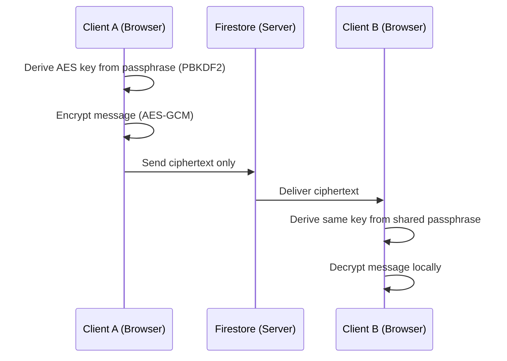

<h1 align="center">🔐 Encrypted Realtime Chat</h1>

<p align="center">
  
</p>

<h3 align="center">Privacy-first realtime messaging with client-side encryption you control.</h3>

<p align="center">
  
  
  
  
</p>

<p align="center">
  
  
  
  
  
</p>

<p align="center">
  <a href="https://cyberdevs.netlify.app"><strong>🚀 Live Demo</strong></a> ·
  <a href="#-getting-started">Getting Started</a> ·
  <a href="#-contributing">Contributing</a>
</p>

---

### 📸 Preview

<p align="center">
  
</p>

> I will add demo soon

---

### 👋 Welcome

Most chat apps either store your messages in plaintext or bury encryption behind complicated setups.

This one gives you **real-time speed + optional military-grade client-side encryption** — toggle it when you need privacy, keep the smooth experience when you don't.

Built as an open-source project so anyone can inspect the crypto, learn from the code, or deploy their own private instance.

---

### 🤔 Why this instead of other chats?

| Problem with most apps | How this solves it |
| ------------------------------ | ----------------------------------------------- |
| Server can read your messages | Encryption happens **in the browser** before anything is sent |
| Encryption is always-on & heavy | On-demand toggle — use it only when you need it |
| Complicated key exchange | Simple passphrase + room name (PBKDF2) |
| Bloated or closed-source | Clean, modern, fully open-source codebase |
| No voice / media / PWA | Voice notes, images, GIFs, PDFs, installable PWA |

---

### 🔑 Encryption Modes

| Feature | 🔒 Encryption ON | 🔓 Encryption OFF |
| --------- | ------------------- | --------------------- |
| **Text Messages** | Encrypted in browser before sending; server sees only ciphertext | Sent in plaintext for instant processing |
| **Media & Files** | Image, GIF, PDF, and audio payloads encrypted client-side | Uploaded directly as plain media data |
| **Security & Privacy** | Passphrase never leaves your client; decryption requires shared key | Fast & seamless chat without key entry |

---

### 🧩 How Encryption Works



The server **never sees plaintext or the encryption key** — both stay in the browser.

---

### 🛠️ Tech Stack

- **Framework:** Next.js 15.3 with App Router
- **Language:** TypeScript
- **Styling:** Tailwind CSS v4
- **UI Primitives:** Radix UI (`Popover`, `DropdownMenu`, etc.)
- **Icons:** Lucide React
- **Authentication & Database:** Firebase Auth & Firestore
- **Security:** Web Crypto API (`SubtleCrypto` for AES-GCM encryption)
- **PWA Integration:** `@ducanh2912/next-pwa`

---

### 📁 Project Structure

```
src/
├── app/                  # Next.js App Router pages & API routes
│   ├── api/og/           # OpenGraph metadata generator API route
│   ├── rooms/            # Dynamic chat room routes (`/rooms/[room]`)
│   ├── layout.tsx        # Root layout with PWA manifest & theme providers
│   └── page.tsx          # Home page & redirect handler
├── components/           # UI components
│   ├── auth/             # Login & SignUp components (`LoginForm`, `Auth.tsx`)
│   ├── chat/             # Modular chat components (`ChatHeader`, `MessageBubble`, etc.)
│   ├── encryption/       # Encryption hooks & toggle components
│   ├── ui/               # Reusable UI primitives (`button`, `popover`, etc.)
│   ├── AvatarDropdown.tsx# User profile menu & avatar dropdown
│   └── ChatUI.tsx        # Main chat orchestrator component
├── hooks/                # Custom React hooks (`useRoomMessages`, `useAudioRecorder`)
└── lib/                  # Core utilities & Firebase helpers
    ├── actions/          # Server actions (`createRoom`, `getRooms`)
    ├── encryption.ts     # Web Crypto API AES-GCM encryption helpers
    └── firebase.ts       # Firebase app initialization & auth provider
```

---

### 💻 Getting Started

<details>
<summary><strong>Prerequisites</strong></summary>

- Node.js 18+ installed
- Firebase Project set up with Auth and Firestore enabled

</details>

<details open>
<summary><strong>Installation</strong></summary>

1. Clone this repository

   ```bash
   git clone https://github.com/MuhammedSuhaib/cybertalk.git
   cd cybertalk
   ```

2. Install dependencies

   ```bash
   pnpm install
   ```

3. Configure environment variables in `.env.local`

   ```env
   NEXT_PUBLIC_FIREBASE_API_KEY=your_api_key
   NEXT_PUBLIC_FIREBASE_AUTH_DOMAIN=your_auth_domain
   NEXT_PUBLIC_FIREBASE_PROJECT_ID=your_project_id
   NEXT_PUBLIC_FIREBASE_STORAGE_BUCKET=your_storage_bucket
   NEXT_PUBLIC_FIREBASE_MESSAGING_SENDER_ID=your_sender_id
   NEXT_PUBLIC_FIREBASE_APP_ID=your_app_id
   ```

4. Run the development server

   ```bash
   pnpm dev
   ```

5. Open [http://localhost:3000](http://localhost:3000) in your browser.

</details>

---

### 📜 Available Scripts

| Command       | Description                              |
|---------------|-------------------------------------------|
| `pnpm dev`    | Start Next.js development server          |
| `pnpm build`  | Build production bundle & PWA service worker |
| `pnpm start`  | Start production server                   |
| `pnpm lint`   | Run ESLint code checks                    |

---

### 🤝 Contributing

Contributions are welcome! Open an issue or submit a pull request to help improve CyberTalk.

---

### ⭐ Star History

<a href="https://star-history.com/#MuhammedSuhaib/cybertalk&Date">
  
</a>

---

<p align="center">
  Crafted by <a href="https://github.com/MuhammedSuhaib"><strong>Muhammed Suhaib</strong></a> · Live Demo: <a href="https://cyberdevs.netlify.app">cyberdevs.netlify.app</a>
</p>
